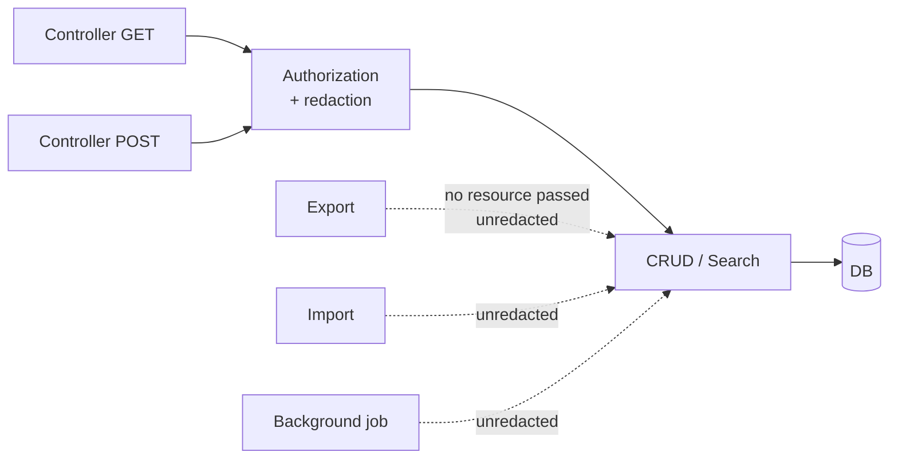
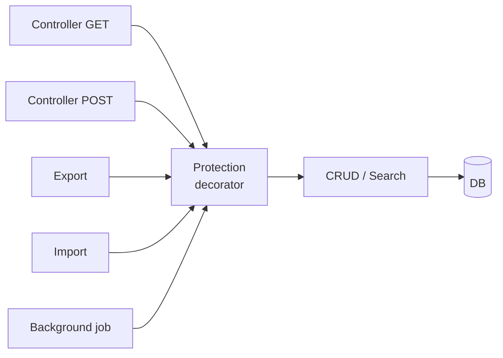
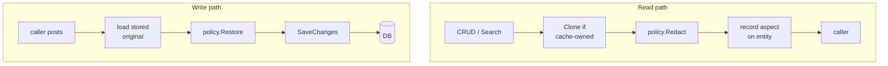

# Redaction at the Service Seam

A generalisation of the order module's `ICustomerOrderDataProtectionService` into a contract any
Virto module can adopt — and the four rules that decide whether it actually holds.

| | |
|---|---|
| **Status** | Proposal |
| **Derives from** | `vc-module-order`, VCST-3912 |
| **Target** | `VirtoCommerce.Platform.Core` |

Every failure mode named here is one the order module's implementation shipped, narrowly avoided,
or still has open.

---

## Why the authorization handler is the wrong place

The order module first hid prices inside `OrderAuthorizationHandler`. It looked like the natural
home: prices are a permission concern, and `order:read_prices` is a permission. It leaked anyway,
in two different ways.

**An authorization handler only sees what a caller hands it.** Redaction lived behind
`authorizationService.AuthorizeAsync(User, resource, requirement)`, so it applied exactly where a
developer remembered to pass a resource. Export, import and several save paths never did.
`order:read_prices` was simply unenforced there.

**And where it was invoked, it could still do nothing.** For search the handler rewrote
`criteria.ResponseGroup` to strip the price flag. That works for orders, because
`CustomerOrderService` honours the response group. Payment and shipment services never read it, so
for `PaymentSearchCriteria` and `ShipmentSearchCriteria` the same line was a silent no-op.

Two symptoms, one cause: the decision sat somewhere every call site had to opt into, and nothing
failed loudly when one didn't.

---

## The seam

Put the decision in a decorator that implements the very interfaces the module already injects —
`ICrudService<T>`, `ISearchService<TCriteria, TResult, TModel>`. Call sites don't change; they
resolve the same interface and get the protected implementation. A path can no longer skip
redaction without someone deliberately reaching around the container for the raw service.

### Today — decision inside authorization



The dotted arrows are the leak.

### Proposed — decision inside the service



Moving the decision from authorization to the service removes the possibility of a call site that
forgot, because there is no longer anything to forget.

---

## Contracts

The design separates *what is sensitive* from *who may see it* from *how it is enforced*. A policy
owns the first two; the service owns the third; the entity carries a flag so consumers can tell a
withheld value from a real one.

### Policy — one per protected aspect, implemented by the module

```csharp
/// A named, independently protectable facet of an entity:
/// "prices", "margin", "contact-details", "payment-instrument".
public interface IDataProtectionPolicy<TEntity> where TEntity : IEntity
{
    string Aspect { get; }

    Task<bool> CanReadAsync(ClaimsPrincipal user, TEntity entity);

    // Remove the aspect from every node of the entity graph.
    void Redact(TEntity entity);

    // Put it back from the stored entity, matching children by id.
    void Restore(TEntity entity, TEntity stored);
}
```

### Entity marker — lets a consumer distinguish withheld from zero

```csharp
public interface IProtectedEntity : IEntity
{
    // Aspect names removed from this instance. Empty means nothing withheld.
    IList<string> RedactedAspects { get; set; }
}
```

### Service — the engine the decorators call

```csharp
public interface IEntityDataProtectionService<TEntity> where TEntity : IEntity
{
    // Read path. Returns the instances to hand on: a redacted clone where the
    // caller's instance is cache-owned, the same instance where it is not.
    Task<IList<TEntity>> RedactAsync(IList<TEntity> entities, bool cloned);

    // Write path. Restores every aspect the caller was not allowed to read,
    // from storage, before the save reaches the CRUD service.
    Task RestoreAsync(IList<TEntity> entities);
}
```

### Registration — in the module's `Initialize`

```csharp
serviceCollection.AddDataProtectionPolicy<CustomerOrder, OrderPricesPolicy>();

serviceCollection.AddProtectedCrudService<CustomerOrder, ICustomerOrderService>();
serviceCollection.AddProtectedSearchService<
    CustomerOrderSearchCriteria, CustomerOrderSearchResult,
    CustomerOrder, ICustomerOrderSearchService>();
```

The order module's shipped service is the same shape collapsed into one class: it implements
`ICustomerOrderService`, `ICustomerOrderSearchService` and `IIndexedCustomerOrderSearchService`,
and exposes `CanReadPrices`, `RemovePrices` and `RestorePrices` as `protected virtual`. Splitting
the policy out is what lets a second aspect exist without a second service.

---

## Four rules that decide whether it holds

Each one is a bug the order module actually shipped or narrowly avoided.

### 1. Clone before you redact — deeply

The platform's own contracts document `clone: false` as returning cache-owned data that *must not
be modified*. Redacting such an instance in place writes the redaction into the shared cache, and
the next caller — one entitled to the data — gets it back stripped. So the `cloned` flag has to be
threaded from the call site into the service, which clones only when it must.

Shallow is not enough. `MemberwiseClone` leaves child collections pointing at the source, so
redacting a child reaches back through the clone into the cached parent. The order module hit
exactly this: `CustomerOrder.Clone()` left `ChildrenOperations` aliased to the original's shipments
and payments.

### 2. Restore on every write, from storage

A caller who read an entity without an aspect will post it back with that aspect zeroed. Unless
every write path reloads the stored entity and puts the aspect back, the first save by a restricted
user destroys data they were never allowed to see.

This is why restoration belongs beside redaction rather than in a controller action: the order
module originally restored prices only in `Update`, leaving create, patch and import to overwrite.
Two properties matter — a new entity has no stored counterpart and needs no restore, and nested
children must be matched by id, not by position.

### 3. Traverse the whole graph, and test the traversal

Every leak found in the order module was a node the hand-written recursion missed: captures and
refunds under a payment, line items and nested payments under a shipment. Redaction written as one
`foreach` per known child collection grows a new hole each time someone adds a collection to the
model, and nothing in the toolchain notices.

Either make the traversal reflective — the module already does this for `ChildrenOperations` via
`FillChildOperations()` — or make it the policy's single named responsibility and test it against
the whole graph. A test that asserts on the root only passes forever.

### 4. Decide what "no current user" means — explicitly

The one that bites hardest, and the reason for the next section. A null principal is not one state;
it is two, and they want opposite answers.

---

## The principal trap

The obvious way to resolve the caller is `IUserNameResolver` plus `SignInManager`. It has a trap in
it. `HttpContextUserResolver.GetCurrentUserName()` **never returns null**: with no `HttpContext` it
returns `"unknown"`, and with an unauthenticated one, `"http:anonymous"`. Neither resolves to a
real user, so a null-check on the name passes straight through and `FindByNameAsync` hands back
null a step later.

A policy that reads that null as "deny" is right for an anonymous web request and wrong for a
background job, an export, or a data migration — which then quietly write out redacted data. In the
order module this is live: an export running outside an HTTP request produces a backup with every
price zeroed, and nothing reports an error.

| Caller | What it means | Correct default |
|---|---|---|
| Resolved user | A real signed-in caller with claims | policy decides |
| Unresolvable, inside an HTTP request | Anonymous or a stale token — untrusted | **deny** |
| No request at all | Job, export, migration, CLI — system context | **full access, opt in** |

So the contract needs a third state it can name. An ambient `IDataProtectionContext` with an
`IsSystemContext` flag, set by whatever hosts non-HTTP work, lets the service bypass redaction
*deliberately*.

> [!WARNING]
> **Do not infer the system context.** Treating an unresolvable principal as trusted is the same bug
> wearing the opposite sign: any request that loses its identity silently becomes an administrator.
> The bypass has to be something a host asserts, never something the absence of a user implies.

One corollary for policy authors: a policy that dereferences the principal must guard it.
`ClaimsPrincipalExtensions.FindPermission` iterates `principal.Claims` with no null check, so a
policy that calls it on a null user throws rather than denying — turning a redaction decision into
a 500.

---

## Aspects, not a boolean

The order module has one aspect and one flag, `WithPrices`. Modules will want several per entity,
independently: prices separately from cost and margin on the same order; contact details separately
from payment instruments on a member. Keying policies by an `Aspect` string and carrying
`RedactedAspects` as a set on the entity keeps them from collapsing into each other.

The set also does something the boolean can't: it makes the server the single source of truth for
the UI. The order module's admin blades originally called
`authService.checkPermission('order:read_prices')` in the browser, so the client re-derived a rule
the server had already applied — two implementations free to drift, and the client's one blind to
any custom policy. Reading the flag off the payload removes that class of bug entirely.

> [!NOTE]
> **Naming collision.** `Microsoft.AspNetCore.DataProtection` already owns the phrase "data
> protection" in this stack, and the platform references it for the Redis key ring. If these
> contracts land in `VirtoCommerce.Platform.Core`, either namespace them unambiguously or name the
> concept **redaction** — which is also a more honest description of what the mechanism does.

---

## Adopting it in a module

In order — each step depends on the one before.

1. **Name the aspects.** One per thing a permission can independently withhold, not one per
   sensitive field.
2. **Implement `IDataProtectionPolicy<T>` per aspect.** Keep `Redact` and `Restore` next to the
   entity model so the traversal is reviewed whenever the graph changes.
3. **Make the entity implement `IProtectedEntity`** and serialise `RedactedAspects` through the API.
4. **Register the policy and the decorators**, and stop injecting the raw CRUD and search services
   anywhere outside the module's Data layer.
5. **Read the flag in the UI** instead of re-checking permissions client-side.
6. **Test three things:** redact and assert every sensitive field on *every node*; save a redacted
   entity and assert storage is unchanged; read with `clone: false` and assert the cached instance
   was not touched.

### The two paths



On the read path, `clone: false` means the service must clone before touching anything, and the
recorded aspect is what the UI reads. On the write path, an absent original means a new entity with
nothing to restore, and restoration runs per denied aspect, matching children by id.

Redaction and restoration are the same policy read in both directions. The clone check on the read
path and the stored-original load on the write path are the two steps most often left out.

---

## Open questions

Unresolved, and worth settling before this lands in the platform.

**Should redaction compose with `responseGroup`, or stay orthogonal?**
The order module reuses the response-group machinery as its redaction vehicle —
`ReduceDetails(Full & ~WithPrices)`. That conflates two different statements: "the caller didn't ask
for this" and "the caller may not have this". Only the first should ever be caller-controlled.
Sharing one enum for both invites a future change that lets a request opt back into a field it
isn't entitled to.

**Indexed search leaks through filters and sorts.**
Redacting results after the index has already answered leaves the sensitive values in the index. A
caller who may not read prices can still filter or sort by price and infer them from the ordering of
what comes back. Redacting the criteria as well as the results is a separate mechanism, and this
design does not yet describe it.

**One extra read per write.**
Restore-on-write means every save through a protected service loads the stored entity first. For
high-volume writes that cost is real, and it is paid whether or not the caller is restricted.
Skipping the load when the caller has every aspect is the obvious optimisation and needs care: the
check must be the same one the read path used.

**Where does the boundary sit for a module that owns several entity types?**
Orders, payments and shipments are separate CRUD services over one aggregate. Decorating each
independently means an aspect's policy runs three times with three chances to disagree. Decorating
only the aggregate root leaves the child services unprotected — which is the state the order module
is in today.
